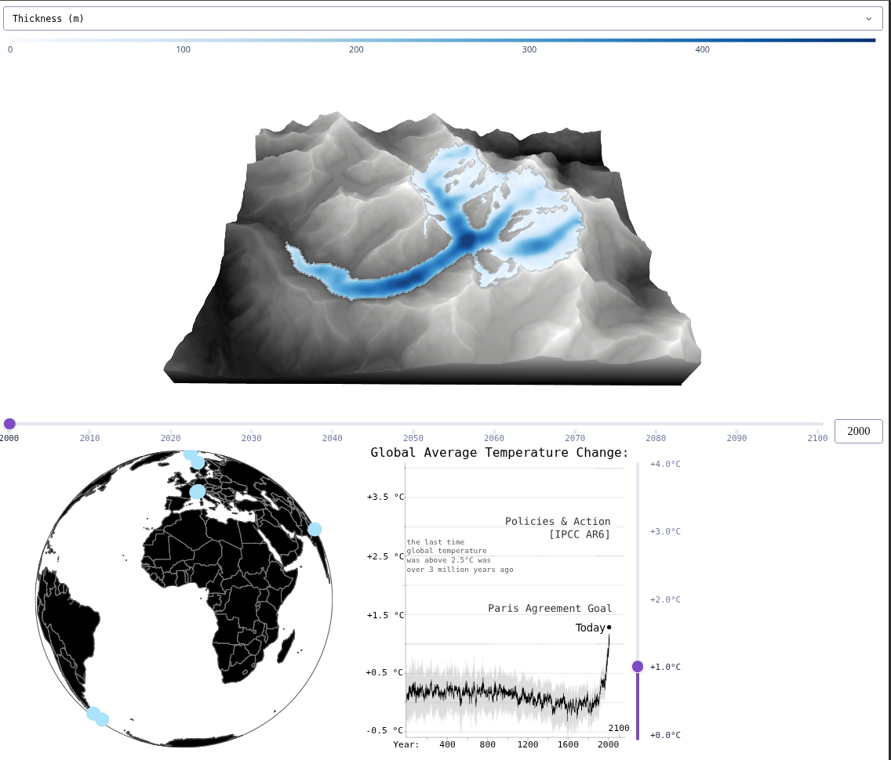

# ❄️ Glacier Dashboard



Interactive Dash app for visualizing glacier simulations in 3D and over time.

## Badges


## Features

* 3D glacier visualization
* Glacier selection via world map
* Time evolution (2000–2100)
* Variables: thickness, velocity, SMB
* Volume time series (absolute and relative)
* NetCDF loading via xarray

## Screenshot


## Run locally

```bash
python3 -m venv .venv
source .venv/bin/activate
pip install dash xarray numpy plotly netCDF4
python dashboard.py
```

Open:

```
http://127.0.0.1:8050
```

## Data

```
data/<glacier>/output_<temperature>.nc
```

Required variables: `topg`, `usurf`, `thk`, `velsurf_mag`, `smb`, `time`

## Notes

* Runs on port 8050
* Served via Nginx + HTTPS in production
* NetCDF errors usually mean missing or corrupted files
